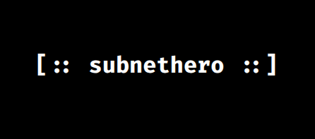

<p align="center">
  
</p>


[](https://github.com/giovanni-iannaccone/subnethero/issues)


[](https://github.com/giovanni-iannaccone/subnethero/stargazers)

# 🦸‍♂️ Subnethero

Subnethero is a powerful C-based command-line tool designed to help network administrators and IT professionals generate subnetting tables and manage IP ranges for different network configurations. Whether you're using a flat approach, FLSM (Fixed-Length Subnet Mask), or VLSM (Variable-Length Subnet Mask), this tool will streamline the process of subnetting and ensure you get precise network breakdowns.

## 🧮 Features
- Multiple subnetting approaches (flat, flsm, vlsm)
- Simple command-line interface
- Displays subnet information in a clear tabular format
- Generates subnetting tables with efficient algorithm
- Save the output to a csv file
- Parse csv to get network configuration
- IP lookup to know which subnet owns an IP

## 📡 Installation
1. Download subnethero with git
```sh
git clone https://github.com/giovanni-iannaccone/subnethero
cd subnethero
```

2. Compile it using make
```sh
make all
```

## 💡 Command-Line Usage

```
subnethero v1.0

Usage:
subnethero [-t | -f | -v] -c cidr -i ip -s n {n devices for each network}

Options:
  -t | --flat        use the flat approach
  -f | --flsm        use the flsm approach
  -v | --vlsm        use the vlsm approach

  -i | --ip          specify the IP of the base network
  -c | --cidr        the CIDR of the original network
  -s | --subs        number of subnetworks (followed by n devices for each network)

  Optional:
  -p | --input       read network configuration from a csv file
  -o | --output      copy the output into csv file
  -l | --lookup      find which subnet owns an ip

Example: subnethero -v -c 24 -i 192.168.1.0 -s 3 64 5 15
```

### Parameters:

- `-t` | `--flat` <br/>
This option uses a flat approach to subnetting, dividing the network into one big subnet.

- `-f` | `--flsm` <br/>
This option applies the Fixed-Length Subnet Mask method, creating subnets of the same size based on the given number of devices.

- `-v` | `--vlsm` <br/>
This option uses the Variable-Length Subnet Mask method, where each subnet can vary in size according to the number of devices specified.

- `-i` | `--ip` <br/>
Enter the starting IP address of the network you want to subnet (e.g., 192.168.1.0).

- `-c` | `--cidr` <br/>
Specify the CIDR notation for the original network (e.g., /24).

- `-s` | `--subs` <br/>
Define the number of subnets you need, followed by the number of devices in each subnet. The tool will calculate the necessary subnet masks.

- `-p` | `--input` <br/>
Read network configuration from a csv file and do calculations on that configuration (e.g., `lookup`).

- `-o` | `--output` <br/>
Copy the output to a csv file (e.g., output.csv), don't specify anything to print the table to stdout.

- `-l` | `--lookup` <br/>
To determine which subnet a specific IP address belongs to, simply add the `-l IP` flag at the end of your command.

## 🛸 Output Format

For each subnet, the output will generate the following columns:

|     IP        | CIDR |   Broadcast   |    Start      |     End       |  Free from     |       to      |
|---------------|------|---------------|---------------|---------------|----------------|---------------|
| 192.168.1.0   | /26  | 192.168.1.63  | 192.168.1.1   | 192.168.1.32  |  192.168.1.33  | 192.168.1.62  |
| 192.168.1.64  | /26  | 192.168.1.127 | 192.168.1.65  | 192.168.1.69  |  192.168.1.70  | 192.168.1.126 |
| 192.168.1.128 | /26  | 192.168.1.191 | 192.168.1.129 | 192.168.1.143 |  192.168.1.144 | 192.168.1.190 |

## 🧩 Contributing
We welcome contributing. See CONTRIBUTING.md file for details

## ⚖️ License
This project is licensed under the GPL-3.0 License. See the LICENSE file for details.

## ⚔️ Contact
- For any inquiries or support, please contact <a href="mailto:iannacconegiovanni444@gmail.com"> iannacconegiovanni444@gmail.com </a>.
- Visit my site for more informations about me and my work <a href="https://giovanni-iannaccone.gith
ub.io" target=”_blank” rel="noopener noreferrer"> https://giovanni-iannaccone.github.io </a>
